# 🌱 Soil2Crop AI Platform

> **AI-powered Soil Analysis & Smart Crop Recommendation System for Farmers**

---

## 🚀 Overview

Soil2Crop is an intelligent agriculture platform that analyzes soil reports and provides smart crop recommendations, irrigation guidance, and farmer support using AI.

---

## 🎯 Problem Statement

* Farmers struggle to understand soil reports
* Crop selection is often based on guesswork
* Lack of real-time guidance and expert support

---

## 💡 Solution

* Upload soil report (PDF/Image)
* AI extracts soil data
* Recommends best crops
* Provides irrigation & alerts

---

## ✨ Features

* 🌾 AI Crop Recommendation
* 📄 Soil Report Analysis (PDF/Image)
* 💧 Irrigation Guidance
* 🤖 AI Farmer Assistant (Chatbot)
* 📊 Market Trends & Government Schemes
* 🦠 Disease Detection (AI-based)
* 📶 Offline Support

---

## 🧠 Innovation

* AI-driven soil intelligence system
* Automated decision-making for farmers
* Integration of OCR + ML + Web platform
* Multi-module smart agriculture solution

---

## 📸 System Architecture

### 🧠 Architecture Diagram

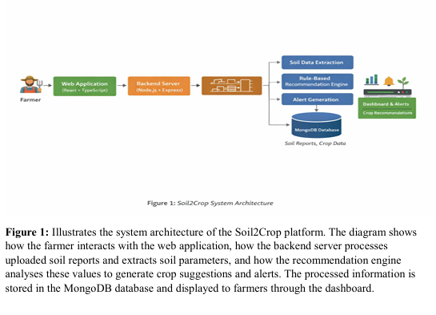

### 🔄 Workflow

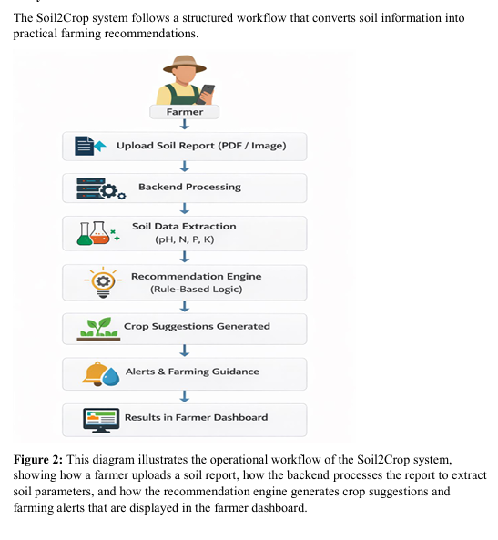

---

## 📱 Application Screens

### 🔐 Farmer Login

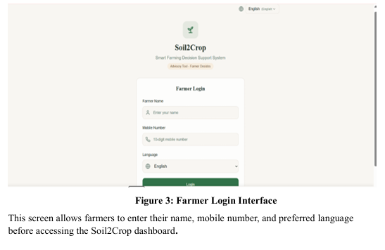

### 🏠 Dashboard

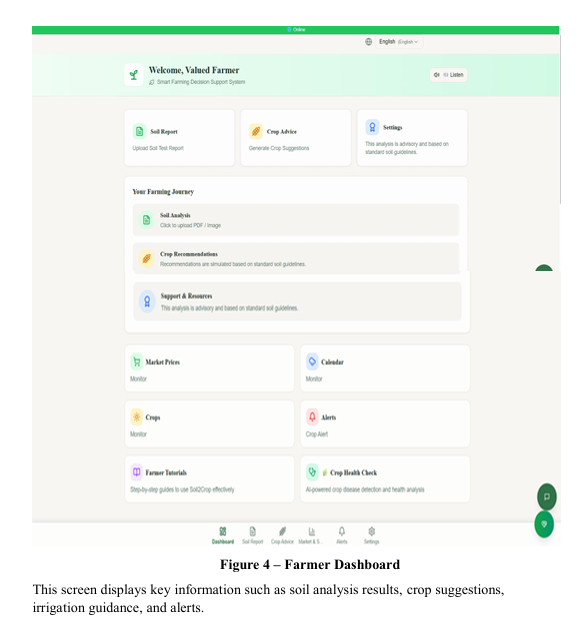

### 📄 Soil Report Upload


### 🌱 Crop Recommendation

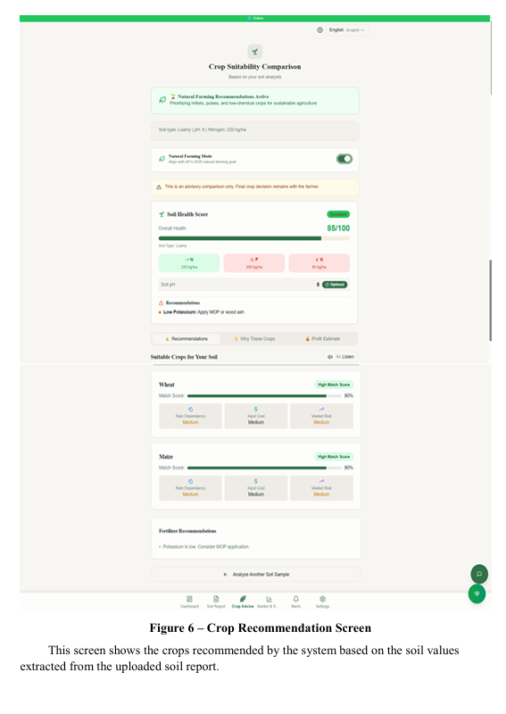

### 📊 Market Prices

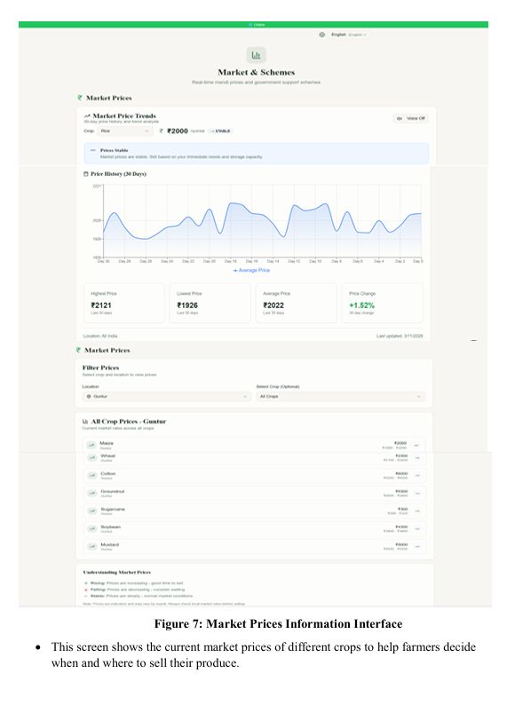

### 🏛 Government Schemes

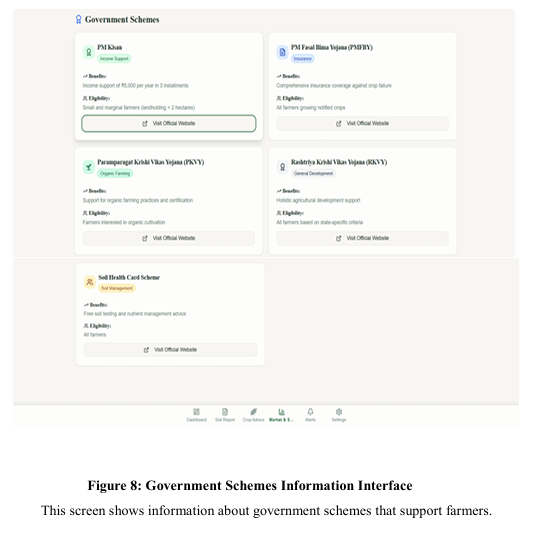

### 🔔 Alerts & Notifications

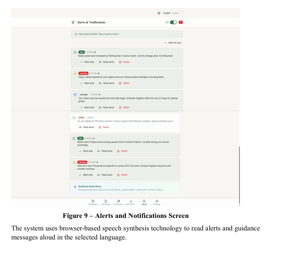

### ⚙️ Settings

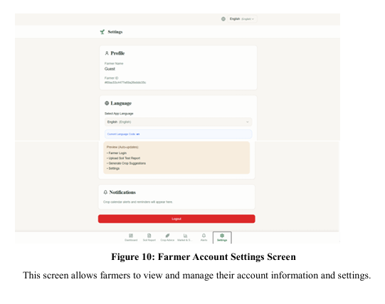

### 🤖 AI Chatbot

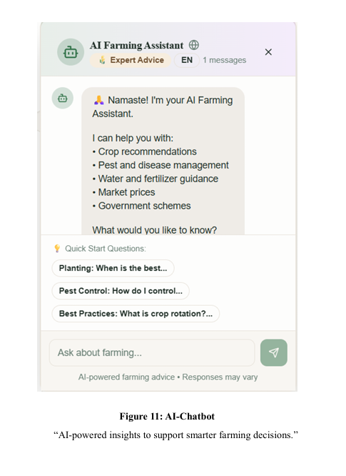

### 🧑‍🌾 Farmer Support

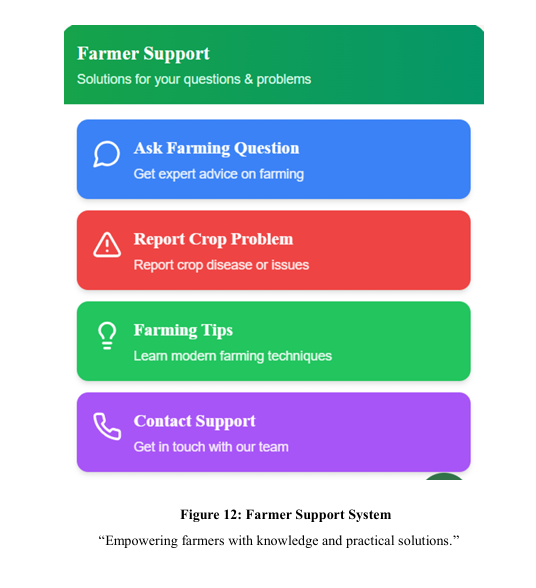

---

## 🏗️ Tech Stack

* **Frontend:** React + TypeScript
* **Backend:** Node.js + Express
* **Database:** MongoDB
* **AI/ML:** Python, OCR
* **Mobile App:** Flutter

---

## 📂 Project Structure

```
soil2crop-app/
│── backend/
│── frontend/
│── docs/
│── soil2crop-flutter/
│── soil2crop-mongodb/
```

---

## ⚙️ Setup Instructions

### Clone Repository

```bash
git clone https://github.com/mdschow9182/soil2crop-app.git
cd soil2crop-app
```

### Backend

```bash
cd backend
npm install
npm start
```

### Frontend

```bash
cd frontend
npm install
npm run dev
```

---

## 🔄 How It Works

1. Farmer uploads soil report
2. Backend processes the data
3. AI extracts soil parameters (pH, N, P, K)
4. Recommendation engine suggests crops
5. Alerts & guidance are generated
6. Results shown on dashboard

---

## 🌍 Impact

* Improves farmer decision making
* Increases crop yield
* Promotes sustainable agriculture
* Bridges technology gap in rural areas

---

## 🔮 Future Scope

* 🛰 Satellite monitoring
* 🤖 Advanced AI predictions
* 📊 District-level analytics
* 🌐 Multi-language expansion

---

## 👨‍💻 Author

**Deepak Sushmanth Medarametla**

---

## ⭐ Support

If you like this project, give it a ⭐ on GitHub!
